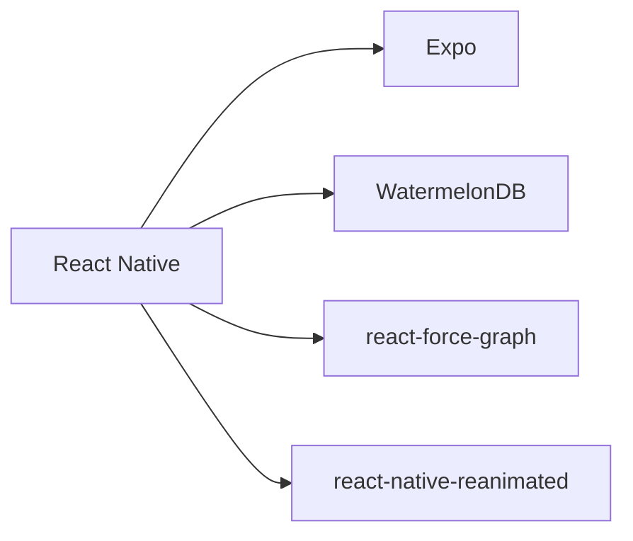
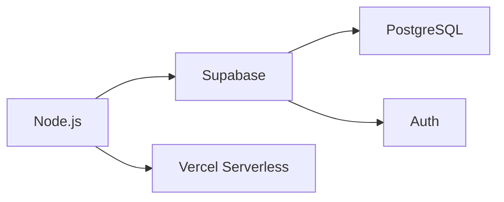
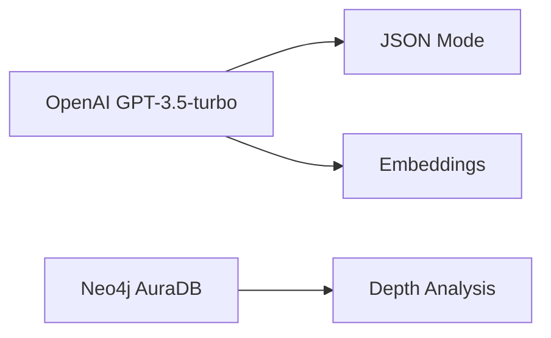
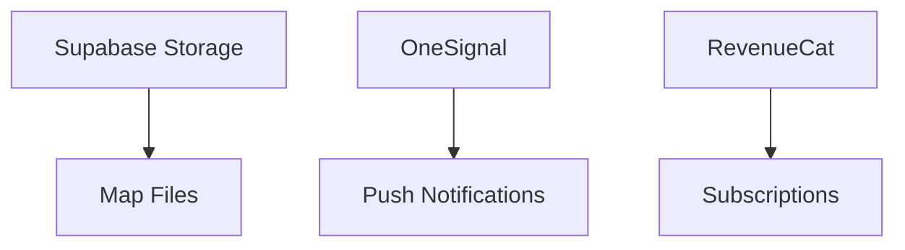

### 📝 Project Summary for AI IDE Prompt  

---

#### **# Usage**  
1. **Bolt Mode**  
   - Lightning-fast idea capture with default depth  
   - "Quick save" for unstructured thoughts  
2. **Standard Mode**  
   - Structured mind mapping with root/child nodes  
   - Cross-file knowledge linking (e.g., merge Python/C++ nodes)  
3. **Rabbit Hole Mode**  
   - AI-generated node/edge suggestions  
   - Depth-aware knowledge exploration  
   - Explanation of cross-depth connections  

---

#### **# Goal**  
Transform fragmented learning time into active knowledge building:  
✅ Replace mindless scrolling with structured knowledge graphs  
✅ AI-assisted discovery of hidden connections between concepts  
✅ Lightweight revision/consolidation tool for mobile  
✅ Future: Social sharing of expert knowledge maps  

---

#### **# Tech Stack**  
**Frontend**  


**Backend**  


**AI Services**  


**Infrastructure**  


---

### **Core Architecture**  
```json
{
  "features": {
    "bolt_mode": {
      "components": ["QuickInput", "AutoDepth", "CloudSaveQueue"]
    },
    "standard_mode": {
      "components": ["NodeEditor", "ForceGraph", "FileManager"]
    },
    "rabbit_hole": {
      "components": ["AISuggester", "DepthAnalyzer", "ExplanationEngine"]
    }
  },
  "sync_flow": [
    "LocalWrite(SQLite)",
    "ConflictDetection",
    "BatchUpload(Supabase)",
    "AIProcessing(Neo4j)",
    "DeltaSync(Device)"
  ]
}
```

---

### **Launch Roadmap**  
| Phase | Timeline | Key Outcomes |  
|-------|----------|--------------|  
| **MVP** | Month 1-3 | Bolt + Standard modes + Basic AI |  
| **Depth AI** | Month 4-5 | Cross-depth analysis + Rabbit Hole 2.0 |  
| **Social** | Month 6-7 | Friend system + Knowledge marketplace |  
| **Monetize** | Month 8+ | Subscriptions + Expert rewards |  

---

### **Starter Code Snippet**  
```javascript
// AI Rabbit Hole Service (Vercel API)
export default async function handler(req, res) {
  const { topic, context } = req.body;
  
  const prompt = `As knowledge graph assistant, suggest 4 child nodes for "${topic}". 
                 Context: ${JSON.stringify(context)}. 
                 Respond in JSON: {suggestions: [{name, description}]}`;

  const completion = await openai.chat.completions.create({
    model: "gpt-3.5-turbo-1106",
    response_format: { type: "json_object" },
    messages: [{ role: "user", content: prompt }]
  });

  res.status(200).json(JSON.parse(completion.choices[0].message.content));
}
```

---

### **Dev Priority Stack**  


Copy this entire markdown block into your AI IDE. It contains all critical specs to generate:  
- Initial React Native component structure  
- WatermelonDB schema templates  
- Supabase sync handlers  
- Vercel API endpoints  
- GPT prompt templates