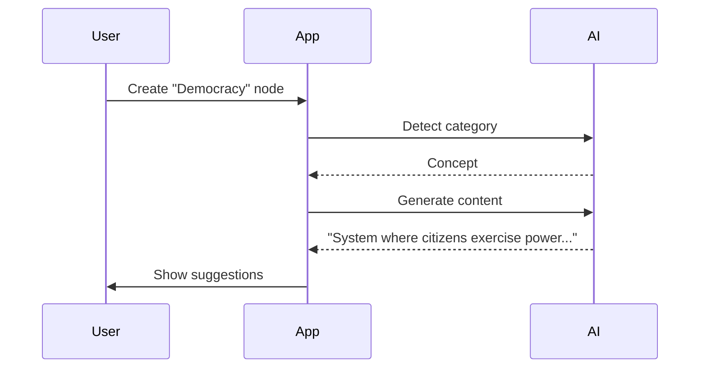

### Streamlined Node Taxonomy: 5 Essential Categories  
Designed for similarity detection and AI content generation - simple yet powerful:

---

#### **1. Concept**  
*The "What" - Core ideas, definitions, and entities*  
**Purpose:**  
- Foundation for all knowledge  
- Anchor for relationships  
- Similarity detection through semantic matching  

**Examples:**  
- "Photosynthesis"  
- "Blockchain"  
- "Supply and Demand"  

**AI Generation Prompts:**  
```  
"Define [CONCEPT] concisely"  
"List 3 key characteristics of [CONCEPT]"  
```  
**Visual:** 💡 Lightbulb icon | 🟦 Blue  

---

#### **2. Mechanism**  
*The "How" - Processes, systems, and functions*  
**Purpose:**  
- Explain operations and workflows  
- Connect concepts to their implementations  
- Detect functional similarities  

**Examples:**  
- "How VPN encryption works"  
- "Protein synthesis process"  
- "Electoral voting system"  

**AI Generation Prompts:**  
```  
"Explain step-by-step how [MECHANISM] functions"  
"What are the key stages of [PROCESS]?"  
```  
**Visual:** ⚙️ Gear icon | 🟩 Green  

---

#### **3. Causality**  
*The "Why" - Reasons, influences, and effects*  
**Purpose:**  
- Show cause-effect relationships  
- Explain motivations and consequences  
- Connect triggers to outcomes  

**Examples:**  
- "Causes of inflation"  
- "Effects of sleep deprivation"  
- "Motivations for colonization"  

**AI Generation Prompts:**  
```  
"What causes [PHENOMENON] to occur?"  
"What are 3 consequences of [ACTION]?"  
```  
**Visual:** ➡️ Arrow icon | 🟥 Red  

---

#### **4. Structure**  
*The "Parts" - Components, organization, and frameworks*  
**Purpose:**  
- Break down complex systems  
- Show relationships between elements  
- Detect compositional similarities  

**Examples:**  
- "Components of a cell"  
- "Government branches"  
- "Software architecture layers"  

**AI Generation Prompts:**  
```  
"Break down [SYSTEM] into its core components"  
"What organizational structure best fits [CONTEXT]?"  
```  
**Visual:** 🧩 Puzzle icon | 🟨 Yellow  

---

#### **5. Context**  
*The "Where/When" - Environment, background, and conditions*  
**Purpose:**  
- Frame understanding  
- Provide situational awareness  
- Connect concepts to environments  

**Examples:**  
- "Economic conditions during the Great Depression"  
- "Cultural influences on Renaissance art"  
- "Technical constraints in embedded systems"  

**AI Generation Prompts:**  
```  
"Describe the key contextual factors around [EVENT]"  
"What environmental conditions enable [PHENOMENON]?"  
```  
**Visual:** 🌍 Globe icon | 🟪 Purple  

---

### Why This Taxonomy Works  
1. **Cognitive Simplicity:**  
   - Covers all key dimensions of knowledge (What, How, Why, Parts, Environment)  
   - Aligns with Bloom's Taxonomy levels  

2. **AI Optimization:**  
   ```mermaid
   graph LR
     A[User Input] --> B{Category Detection}
     B --> C[Concept] --> D[Define/Describe]
     B --> E[Mechanism] --> F[Explain Process]
     B --> G[Causality] --> H[Identify Causes/Effects]
     B --> I[Structure] --> J[List Components]
     B --> K[Context] --> L[Frame Environment]
   ```

3. **Similarity Detection:**  
   - Within-category: Find similar concepts/mechanisms  
   - Cross-category: Discover concept → mechanism → causality chains  

**Step 3: AI-Assisted Creation**  


**Step 4: Similarity Features**  
```cypher
// Neo4j: Find structurally similar nodes
MATCH (n:Structure {name: "Cell Anatomy"})
MATCH (m:Structure)
WHERE gds.similarity.cosine(n.embedding, m.embedding) > 0.7
RETURN m.name
```

---

This taxonomy gives you:  
- 5 clear mental buckets for users  
- Optimized AI prompt routing  
- Efficient similarity detection  
- Visual clarity  
- Room to grow (add subcategories later if needed)  

Start with these 5 - they cover 95% of knowledge mapping needs while keeping your app beautifully simple!